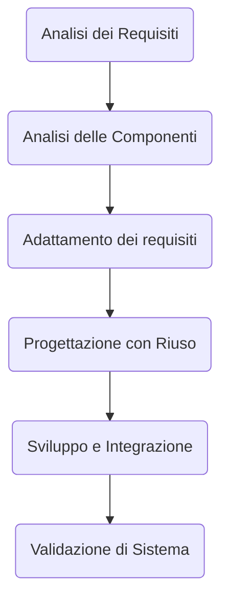

*Sistematico*: non importa chi fa le cose l'importante è che ognuno le faccia allo stesso modo, in questo caso seguendo un *way of working*. Tutti fanno le cose in modo deciso
*Disciplinato*:  Tutti fanno le cose allo *stato dell'arte*
*Quantificabile*: Dobbiamo fare le cose e averne un dato 
##### Il concetto di ciclo di vita
- *Concezione* -> *sviluppo* -> Utilizzo -> Ritiro
- La transizione tra stati avviene per azione di processi di ciclo di vita
- Compito di un progetto è far progredire lo stato di avanzamento di un prodotto SW lungo il suo ciclo di vita
- Per farlo il progetto mobilità delle attività di specifici processi
	- Attività che ordiniamo in funzione delle dipendenze tra i loro ingressi e le loro uscite
	- Fissando così i criteri di loro attivazione e di completamento
- Chiamiamo **fase** il tempo di stazionamento in un singolo stato di ciclo di vita o in una singola transizione tra stati.
	- Essa designa uno stato consistente, entro un dato segmento temporale
	- Per questo *fase* non è vero sinonimo di *attività*
- Esistono molteplici cicli di vita che differiscono tra loro per transizioni tra stati e regole di attivazione
	- Per distinguere tra loro ne idealizziamo le caratteristiche in *modelli* di ciclo di vita
- Aderire a un particolare modello di ciclo di vita comporta vincoli sulla pianificazione e gestione del corrispondente progetto
	- Questo influenza il proprio *way of working* e i suoi strumenti di supporto
- In questo corso, ci occupiamo di **modelli di sviluppo** SW
### Modello
- Insieme di specifiche che descrivono un fenomeno di interesse (*astratto o concreto*)
	- In modo che non dipende dall'osservatore
	- Dimostrato corretto, empiricamente o per teorema
- I modelli aiutano a studiare, comprendere, misurare e trasformare l'oggetto di interesse
	- Il modello specifica *cosa* quell'oggetto sia
	- L'architettura (*design*) specifica <u>come</u> esso funzioni
	- L'analisi (*del modello*) spiega <u>perchè</u> quell'oggetto fa quel che fa nel modo in cui lo fa
*Esempio modello SDLC* -> un modello che non contempla il *ritiro*
- Lo stadio di *evoluzione* innesca nuovi attraversamenti di ciclo
##### Modelli di sviluppo
- Alle origini vi fu solo il *non-modello* Code-'n-fix 
	- *Cowboy coding*
- Attività senza organizzazione comprensibile dall'esterno
	- L'esatto contrario di sistematico, disciplinato, quantificabile, che sono le quantità distintive dell'applicazione dell'Ingegneria del Software
- Questo porto la crisi del SW, che porto alla nascita di SWE
- Ne nacque una successione di modelli organizzati

| **Modello**  | **Tratti caratteristici**                                         |
| ------------ | ----------------------------------------------------------------- |
| Cascata      | Rigide fasi sequenziali                                           |
| Incrementale | realizzazione in più passi                                        |
| A componenti | Orientato al riuso                                                |
| Agile        | Altamente dinamico, fatto di brevi cicli iterativi e incrementali |
- **Iterazione**: raffinamenti o rivisitazione (*distruttivo*)
	- *come la pittura che aggiunge o copre*
- **Incremento**: aggiunte successive ad un impianto base (*costruttivo*)
	- *come la scultura, che opera per sottrazione, in una sola direzione*
- **Prototipo**: provare a scegliere soluzioni
	- *Usa e getta o per incrementi*
- **Riuso** *Se voglio usare cose mi devo piegare io non il codice altrimenti mi conviene rifare*
	- Copia-incolla opportunistico (_occasionale_)
		- *basso costo, scarso impatto*
	- Sistematico (*per progetto / famiglia di prodotti / ogni prodotto*)
		- *Maggior costo di adozione, maggior impatto*
# Modello sequenziale (a cascata)
*centrato sull'idea di <u>processi ripetibili</u>*
- Successioni di *fasi* <u>rigidamente sequenziali</u>
	- Non ammette ritorno a fasi precedenti: eventi eccezionali riportano all'inizio
	- Le iterazioni costano troppo: non sono viste come buon mezzo di mitigazione delle incertezze di sviluppo
	- Qui e solo qui possiamo parlare compiutamente di *fasi*
- Prodotti
	- Principalmente <u>documenti</u>, fino poi a includere il software
- L'ingresso in uno stato di avanzamento è vincolato da <u>pre-condizioni</u> (_gate_)
	- Che devono essere soddisfatte dalle <u>post-condizioni</u>  delle transizioni di ingresso
- In questo modello il progetto è una successione di fasi distinte, non sovrapposte nel tempo
- È stato usato per lo sviluppo di sistemi complessi, organizzati in *catene di fornitura*
	- E quindi sopratutto per ragioni organizzative
- Ogni fase (*stato/transizione*) viene definita da:
	- Attività previste e prodotti attesi in ingresso e in uscita
	- Contenuti e struttura di documenti che descrivono lo stato raggiunto e le attività svolte
	- Responsabilità e ruoli coinvolti nelle attività
	- Scadenze di consegna dei prodotti
- Entrare, uscire, stazionare in una fase comporta lo svolgimento di determinate azioni
	- Realizzate come attività di specifici processi
![[Screenshot 2024-10-08 alle 11.47.15.png]]
## Critica al modello sequenziale
- Difetto Principale: **eccessiva rigidità**
	- Stretta sequenzialità: nessun parallelismo nessun ritorno
	- Non ammette modifiche nei requisiti in corso d'opera
	- Visione rigida (*burocratica*) e poco realistica del progetto
- Correttivo 1: con prototipazione
	- Prototipi di tipo *usa e getta*
		- *per capire meglio i requisiti o le soluzioni, strettamente all'interno di singole fasi*
- Correttivo 2: con ritorni
	- Come allenamenti prima dell'atto definitivo
		- *per imparare a fare sempre meglio ciò che serve a realizzare il prodotto*
---
### Incrementali o iterativo?
- Problemi molto complessi richiedono di procedere provando
	- Spesso tramite iterazioni potenzialmente distruttive
- Conviene che lo sviluppo proceda per piccoli passi incrementali
	- Evitando di integrare il prodotto tutto-in-una-volta (*aka big-bang-integration*)
	- Assai meglio adottare l'*integrazione continua*
- Integrazione e incremento coincidono quando la sostituzione raffina ma non ha impatto sul resto
##### Vantaggi incrementali
- Possono produrre valore ad ogni incremento
	- Un insieme crescente di funzionalità utili diventa presto e progressivamente disponibile
	- Magari a valle di una buona prototipazione, non usa-e-getta
- Procedere per incrementi riduce il rischio di fallimento
	- Anche se il rischio non può essere azzerato...
	- Come un ciclo `for`, da cui sappiamo quando usciremo, a meno di eccezioni
- Le funzionalità fondamentali (*quelle più immediatamente necessarie*) vanno sviluppate prima
	- Il loro uso frequente aiuta a verificare che siano solide
##### Vantaggi dei modelli iterativi
- Possono applicare a qualunque modello di sviluppo
	- Comportando però forte potenziale distruttivo
- Consentono maggior capacità di adattamento
	- Insorgere di problemi, cambio di requisiti, collasso tecnologico
- Comportano il rischio di non convergenza
	- Come un ciclo `while`, da cui non sappiamo per certo se e quando usciremo
- Tecniche di mitigazione
	- Decomporre il sistema in parti, lavorando prima su quelle più critiche, perchè più complesse o con requisiti più incerti
	- Fissando un limite superiore al numero di iterazioni
###### Rischi dei modelli iterativi
![[Screenshot 2024-10-08 alle 14.57.27.png]]
- Nel 1992 si inizia a parlare di **_technical debt_** per designare parti di _design_ o codice bisognose di **_refactoring_**, cioè di future "passate <u>iterative</u>"
	- Quelle parti costituivano un debito, contratto per avanzare più velocemente, ma da saldare al più presto, per non pagarlo, dopo, con interessi composti
- Oggi quel termine designa tutti i punti dello sviluppo nei quali la soluzione realizzata non concorda con la nostra comprensione corrente di come dovrebbe essere
	- Quei tipi di soluzione sono detti **_kludge_** e sono debiti da sanare presto, perchè la loro presenza toglie qualità al prodotto
# Modello Incrementale
- Prevede rilasci multipli e successivi
	- Ciascuno realizza un incremento di funzionalità
- I **requisiti** vanno classificati presto e trattati in base alla loro importanza strategica
	- I primi incrementi puntano a soddisfare i requisiti più importanti sul piano strategico
	- Quello che serve avere prima in funzione di cosa vogliamo poter dimostrare (agli *stakeholder*)
- Così i requisiti "*importanti*" diventano presto chiari e stabili, quindi più facilmente soddisfacibili
	- Quelli meno importanti hanno invece più tempo per stabilizzarsi e armonizzarsi con lo stato del sistema
![[Screenshot 2024-10-08 alle 15.12.21.png]]
- Analisi dei requisiti e progettazione architetturale vengono svolte una stessa passata iniziale
	- Per stabilizzare presto i requisiti principali
	- Per stabilizzare presto l'**architettura** (_design_) complessiva del sistema, che deve essere capace di accogliere incrementi futuri senza rompersi
	- Per poter decidere preventivamente il numero di incrementi e i loro specifici obiettivi
- La realizzazione avanza per passi incrementali
	- Raffinando l'analisi dei requisiti e la progettazione di dettaglio, strettamente entro l'architettura adottata
	- Il completamento dei primi incrementi serve a rendere disponibili le principali funzionalità
![[Screenshot 2024-10-08 alle 15.16.11.png]]
# Modello a componenti

- Molto di quello che ci serve già esiste
- Molto di quello che faremo potrebbe servirci ancora
	- Analisi dei requisiti guidata dalla possibilità di riuso di quanto già esista
	- Realizzazione che cerca di favorire riuso futuro
# Metodi Agili
Si basano su 4 principi ideologici:
1. **Individuals and interactions over processes and tools**
	- *L'eccessiva rigidità ostacola l'emergere del valore*
2. **Working software over comprehensive documentation**
	- *La documentazione non sempre corrisponde a SW funzionante*
3. **Customer collaboration over contract negotiation**
	- *L'interazione con gli stakeholders va incentivata e non ingessata*
4. **Responding to change over following a plan**
	- _la capacità di adattamento al cambiare delle situazioni è importante_
---
###### Contro-argomentazioni
- SW privo di documentazione produce costo, non valore
	- Commentare il codice <u>non</u> basta: serve spiegare e motivare le scelte realizzative
- Senza un piano, non si possono valutare rischi e direzioni di avanzamento
	- La sola misurazione di consuntivo <u>non</u> basta
- Cambiare si può, ma con consapevolezza del rapporto costo/benefici
---
- L'idea di base è il concetto di "*user story*"
	- Una funzionalità significativa che l'utente vuole realizzare con il SW richiesto: uno **Scenario d'uso**
- Ogni *user story* è definita da
	- Un documento di descrizione del problema individuato
	- il verbale delle conversazioni avute con gli *stakeholder* per discutere e comprendere il problema
	- La strategia da usare per confermare che il SW realizzato soddisfi gli obiettivi di quel problema
- Assunti base
	- Suddividere il lavoro in piccoli incrementi a valore aggiunto, magari anche sviluppabili indipendentemente
	- Sviluppare ciascun incremento in sequenza continua dall'analisi all'integrazione
- Obiettivi strategici
	- Poter <u>sempre</u> dimostrare al cliente lo stato corrente
	- Verificare l'avanzamento tramite progresso reale, capace di fornire riscontro (*feedback*)
	- Dare agli sviluppatori la soddisfazione del risultato
- Buoni esempi
	- *Scrum, Kanban, Scrumban*
# Scrum
[[ScrumMTSS]] //per approfondire https://github.com/SerpenTaki/MTSSnotesUnipd

