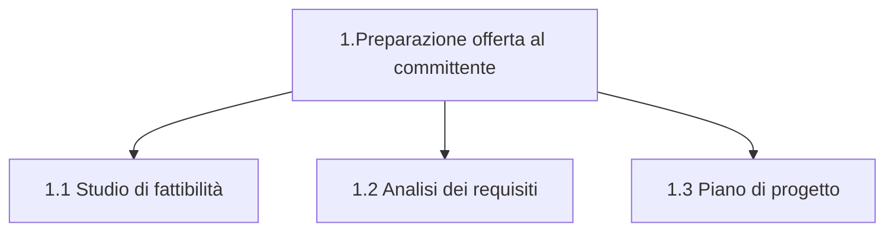

Compito di chi gestisce un progetto decide quanto saranno le milestone e quali saranno le baseline. 
**Validation**: è la domanda che ci facciamo fare a fine progetto: *ho fatto tutto cio che mi è stato richiesto?* -> aver lavorato affinchè la risposta è si, e se la risposta fosse no allora mi tocca rifare.
Per fare bene una validation mi serve una checklist, quindi una specie di lista che una milestone è ragionevole o irragionevole.
## Fondamenti di gestione
- Stabilire il proprio *way of working*
	- Adattando processi di ciclo di vita alle proprie necessità, come determinate dal contesto (*regolamento, vincoli*)
	- Istanziando quei processi in attività di progetto in procedure aiutate da strumenti
- Determinare le risorse disponibili
	- Ore-persona, calendario
- Fissare gli obiettivi di avanzamento...
- ...Fissare gli obiettivi di avanzamento
	- In una successione di **_milestone_**, da quella finale <u>all'indietro</u>
	- Orientando le attività <u>in avanti</u>, per raggiungere una successione di *baseline*, fino al raggiungimento degli obiettivi finali
- Determinare le risorse necessarie per svolgere quelle attività
	- Questo si chiama *preventivo*
- Adattare gli obiettivi alle disponibilità effettive
# Glossario
- Una *milestone* è una data di calendario che fissa un punto di avanzamento atteso nel tempo di progetto
- Il raggiungimento degli obiettivi di avanzamento attesi a una *milestone* è sostanziato dallo sviluppo di una *baseline*
- Una *baseline* è la versione <u>approvata</u> di un prodotto di lavoro (di progetto) che può essere modificato <u>solo</u> attraverso procedure formali di controllo delle modifiche
	- Il prodotto di progetto è un aggregato di SW e di documentazione
- Ogni *baseline* è posto sotto controllo di versione e di configurazione
![[Screenshot 2024-10-22 alle 15.07.52.png]]
- Controllare l'avanzamento con frequenza e regolarità
	- In modalità *push*: il completamento dell'azione causa notifica
	- Invece che *pull* "chiedo di sapere"
	- Per risultati: *baseline* che raggiungono *milestone*
	- Per costi sosteniti: *consuntivo di periodo*
- Aggiornare la pianificazione futura in funzione dell'avanzamento rilevato (*preventivo a finire*)
- Usare la tecnica agile della *retrospettiva*
### Buone qualità della milestone
1. Specifiche per obiettivi di avanzamento e dimostrabile per risultati attesi (__concretezza specifica sulle aspettative__)
	- In una successione naturalmente incrementale
2. Obiettivi coerenti con la strategia di progetto
	- Significativi per il _team_ e per gli _stakeholder_
3. Obiettivi tempestivi e coerenti con le esigenze di calendario
	- Ad esempio RTB-> da lì devo passare, revisione di avanzamento che la baseline è accettata sul prodotto
4. Incrementi delimitati per ampiezza e ambizioni
	- Realisticamente raggiungibili *se non raggiunti non riscontro un feedback ma fallisco un progetto, nel nostro caso*
5. Misurabili per quantità di impegno necessario
6. Traducibili in compiti assegnabili a singoli individui
	- Corrispondenti a uno *sprint* di metodo agile
## Ruoli e funzioni di progetto
- Le organizzazioni specializzano il proprio personale per **funzioni**
- In un progetto le persone assumono **ruoli**
	- Ogni *ruolo* ha responsabilità (*ownership*) su specifiche attività di specifici processi
- I gruppi di progetto didattico sono organizzazioni temporanee, nei cui ruoli i membri ruotano, per ragioni formative.
# Ruoli
- **Analisti**
	- Conoscono il dominio del problema e hanno esperienza professionale
	- Hanno molta influenza sul successo del progetto
	- Sono pochi: non seguono il progetto fino alla consegna
- **Progettisti** _incaricati di produrre il design_ o **Designer**
	- Hanno competenze tecniche e tecnologiche aggiornate
	- Determinano le scelte realizzative
	- Sono pochi: seguono lo sviluppo, non la manutenzione.
- **Implementation** **Programmatori**
	- Scrivere codice che faccia ciò che il designer si aspetta
	- Contribuiscono alla realizzazione e manutenzione del prodotto
	- Hanno competenze tecniche ma deleghe limitate
	- Formano la categoria più popolosa
- **Verificatori**
	- Sono presenti per l'intera durata del progetto
	- Hanno competenze tecniche, esperienza professionale, conoscenza del *way of working*
	- Hanno capacità di giudizio e di relazione
	- Più è grande il progetto più grande sarà la verifica, quindi occuperà molto più tempo la verifica, della implementazione.
	- La verifica cresce secondo gli output delle varie attività
- **Responsabile** (*project manager*)
	- Governa il *team* e rappresenta il progetto verso l'esterno (livello *customer*)
		- Accentra le responsabilità di scelta e approvazione
		- Partecipa al progetto per tutta la sua durata
	- Ha responsabilità su:
		- Pianificazione e gestione delle risorse
		- Controllo, coordinamento e relazioni esterne
	- Deve avere conoscenze e capacità tecniche (*1 solo responsabile in un periodo nel nostro caso*)
- **Amministratore di sistema _(sysadmin)_**
	- La persona che garantisce che gli strumenti che abbiamo funzionino bene 
	- Definisce, controlla e manutiene l'ambiente IT di lavora
		- Selezione e messa in opera di risorse informatiche a supporto del *way of working*
		- Azione proattiva meglio che reattiva
		- Gestione delle segnalazioni (*ticket*) su non-funzionamento dell’infrastruttura 
	- Funzione o ruolo?
		- Funzione aziendale in organizzazione strutturale, con più progetti simili (*ragioni di standardizzazione*)
		- Altrimenti ruolo di progetto
## Gestione qualità
- La funzione di più recente introduzione 
	- Funzione aziendale, non ruolo di progetto
- La **qualità** ha più dimensioni
	- Riguarda sia i prodotti che i processi
	- Interessa sia il committente che la direzione aziendale
- La garanzia di qualità produce confidenza
	- Richiede applicazione rigorosa dei processi adottati
	- E loro manutenzione migliorativa -> ciclo PDCA
# Pianificazione di un progetto
- Definizione delle attività
	- Per pianificare lo svolgimento e valutare il progetto
	- Per avere una base su cui gestire l'allocazione delle risorse
	- Per stimare e controllare scadenze e costi
- Strumenti per la pianificazione
	- Diagrammi di Gantt
	- *Programme Evaluation and Review Technique* (PERT)
![[Screenshot 2024-10-22 alle 16.13.06.png]]
#### Ora produttiva vs orologio
- La "taglia" di un progetto, per lunghezza temporale e costi economici, è determinata in sede di preventivo dal numero di **ore produttive** stimate necessarie per la realizzazione di quanto richiesto.
- Lo svolgimento di ogni singola attività di progetto consuma:
	- Ore di orologio $O^O$, nella misura del tempo personale
	- Ore produttive, $O^P$, in funzione del tasso di raggiungimento degli obiettivi
- Il rapporto $R=\frac{O^O}{O^P}$ dice la pressione sulla persona $(R>1)$ o il margine utile del fornitore $(R<1)$ 
- La pianificazione deve scendere a un dettaglio idoneo a individuare attività brevi
	- Ciascuna assegnabile a un singolo incaricato
- Le attività hanno struttura gerarchica, ad albero
	- Ogni macro-attività genitore si compone di micro-attività figlie
	- Dislocate nel tempo in modo da soddisfare i loro vincoli di precedenza e non creare attese

### Diagramma di Gantt
- Dislocazione temporale delle attività
	- Per rappresentarne la durata
	- Per rappresentarne sequenzialità e parallelismo
	- Per confrontare le stime con i progressi
![[Screenshot 2024-10-22 alle 16.41.14.png]]
### Diagrammi PERT
- Dipendenze temporali tra attività
	- Per ragionare all'indietro sulle scadenze di progetto, individuando il possibile margine temporale (*slack time*)
	- Individuando i **cammini critici** -> sequenze di attività ordinate con esito importante, e dipendenze temporali tra loro molto strette
![[Screenshot 2024-10-22 alle 16.43.39.png]]
![[Screenshot 2024-10-22 alle 16.43.55.png]]
## Allocazione delle risorse
- Assegnare attività a ruoli e ruoli a persone
- Difficoltà
	- Non sottostimare 
	- Non sovrastimare
- Molte risorse sono impegnate su più progetti
	- Aziendalmente, per non incorrere in sotto-utilizzo
- Gestire più cammini critici su più progetti
![[Screenshot 2024-10-22 alle 16.49.11.png]]
## Stime dei costi di progetto
- Come pianificare?
	- Con strumenti che permettano di organizzare le attività
	- Con strumenti che permettano di evidenziare le criticità
	- Con strumenti che permettano di studiare scenari
- Come definire durata e costo delle attività?
	- Prima calcolando il *tempo/persona* stimato necessario
	- Poi rapportandolo al tempo di calendario
- Come stimarlo?
	- Esperienza, analogia, competizione, algoritmo predittivo, raffinamenti
- Grana grossa sull'insieme, grana fine entro periodi brevi
#### Fattori di influenza sulle stime
- Dimensione del progetto
- Esperienza del dominio
- Familiarità con le tecnologie
- Produttività dell'ambiente di lavoro
- Qualità attesa
## Fonti di rischio
- Tecnologie di lavoro e di produzione SW
- Rapporti interpersonali
- Organizzazione del lavoro
- Requisiti e rapporti con gli *stakeholder*
- Tempi e costi
### Gestione dei rischi
*attività che mi permette quali possono essere i rischi che potrei trovare ovvero magari imparare un repo o un nuovo linguaggio, i vari bug che potrebbero accadere, in modo tale che questi __rischi__ non accadano oppure se accadono saperli gestire __ASAP__*
*In classe fa l'esempio della bici ad esempio se si spacca la camera d'aria-> viaggiare con delle camere d'aria in più, sapere dove fermarsi, saper cambiare la camera d'aria. Oppure un rischio potrebbe essere quello che la ruota si sgonfi e quindi prima di un viaggio lungo in bici si viaggia con la gomma un po' più gonfia*
*Un rischio del progetto potrebbe essere qualcuno che non faccia qualcosa per problemi, perchè non ha voglia o perchè non riesce, quindi questo rischio va affrontato possibilemente sul nascere e non verso il controllo perchè potrebbe essere troppo tardi*.
**I rischi non sono statici ma cambiano nel tempo quindi sono dinamici e possono diminuire con il tempo**
- Identificazione
	- Nel progetto, nel prodotto, nel mercato
- Analisi
	- Probabilità di occorrenza, conseguenze possibili
- Pianificazione
	- Come evitare i rischi o mitigarne gli effetti
	- *saggio applicarla a periodi con un ragionamento tale che applicarla a piccoli periodi diventa più facilmente applicabile*
		- SCRUM: noi dividiamo il tempo in sprint e ad ogni sprint noi ci diamo degli obiettivi "piccoli su tempo breve" che ci avvicinano verso la meta di un progetto (*rilascio*)
		- Quanti periodi, quanta durata del periodo, come ripartiamo gli obiettivi nel periodo
			- Esempio nostro progetto, tempo inizio "da quando i gruppi sono attivi", tempo di fine "da quando c'è la final release"
- Controllo
	- Attenzione continua tramite rilevazione di indicatori
	- Attuazione delle procedure di mitigazione
	- Raffinamento delle strategie
![[Screenshot 2024-10-22 alle 16.57.43.png]]
**RTB:** Requirements and Tecnology Baselone
**PB:** Product Baseline
è sconsigliabile che questi 2 macro-periodi siano obiettivi di avanzamento ok che sono richiesti per il progetto ma è molto più consigliabile che questi siano divisi in micro-periodi, *diario di bordo settimanale*-> può questo indicare che i periodi diventano settimanali? non è scontato. I periodi saranno di ampiezza settimanale? improbabile per dare obiettivi significativi.
*retrospettiva*: attività regolamentata da inserire a ogni fine periodo, per vedere se gli obiettivi posti sono stati raggiunti e raffinare un ragionamento che affini il prossimo obiettivo.
