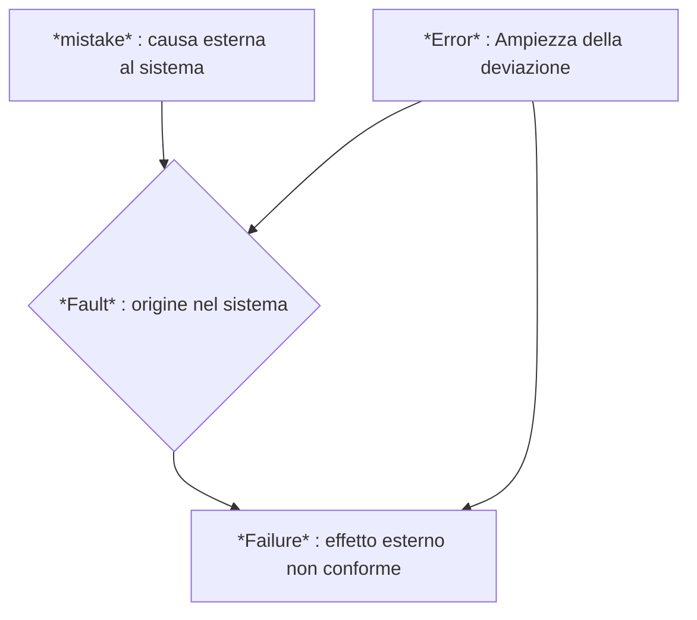

- **_Software Verification_**
	- Provides objective evidence that the outputs of *a particular segment* of the software development meet all the requirements specified for it
	- Looks for consistency, completeness, and correctness of those output
	- *Provides support for subsequent conclusion that software is validated*
- **_Software Validation_**
	- Confirmation by examination and provision of objective evidence that
	1. The SW specifications conform to user needs and intended uses
	2. The requirements implemented through SW can be consistently fulfilled
**In pratica**
- La **verifica** agisce su singoli segmenti di sviluppo accertando che l'esecuzione in essi (*segmenti*) non abbia introdotto errori
	- Approvando la *baseline* associate alle *milestone* di progetto
- La **validazione** agisce a fine progetto, accertando che il prodotto finale sia pienamente conforme alle aspettative
- La verifica prepara il successo della validazione
![[Screenshot 2024-12-03 alle 11.31.48.png]]
- Una *milestone* è una data di calendario che fissa un punto di avanzamento atteso
- Il raggiungimento di quegli specifici obiettivi di avanzamento va sostanziato da una *baseline*
- Una *baseline* è la versione approvata di un prodotto di lavoro (parte di un progetto) che può essere modificato solo attraverso procedure formali di controllo delle modifiche
- Il prodotto di un progetto è un aggregato di SW e di documentazione
## La verifica ha 2 forme
- **Analisi statica** **AS**
	- Non richiede esecuzione dell'oggetto di verifica
	- Studia documentazione e codice (sorgente, oggetto)
	- Accerta conformità a regole, assenza di difetti, presenza di proprietà desiderate
	- Può essere usata nella validazione
- **Analisi dinamica AD**
	- Richiede esecuzione dell'oggetto di verifica (quando questo è eseguibile, cioè è SW)
	- Viene effettuata tramite prove (*test*)
	- Viene usata anche nella validazione
### Analisi statica
- Non richiedono esecuzione dell'oggetto di verifica, è applicabile a ogni prodotto di processo
	- Per tutti i processi attivati nel progetto
- Può usare **metodi di lettura** *(desk check)*
	- Impiegati solo per prodotti semplici
- Oppure **metodi formali** (p.es. algebrici)
	- Basati su prova assistita di proprietà, utile sopratutto quando la dimostrazione empirica ha un costo proibitivo
## Metodi di lettura
- **Walkthrough** e **Inspection**
	- Attraverso lettura - umana o automatizzata - dell'oggetto di verifica
- La loro efficacia dipende dall'esperienza dei verificatori o l'accuratezza degli strumenti automatici
	- Nell'organizzare le attività da svolgere
	- Nel garantire esaustività
	- Nel documentare le risultanze
- Modalità relativamente complementari tra loro
---
# Walkthrough
### Definizione
- **Atteggiamento**
	- Non sappiamo (*ancora*) dove è più probabile che vi siano difetti
- **Obiettivo**
	- Rilevare difetti attraverso lettura critica <u>ad ampio spettro</u> dell'oggetto in esame
- **Attori**
	- Gruppi misti autori/sviluppatori, con ruoli distinti tra loro
- **Strategia**
	- Esame privo di assunzioni o presupposti
- **Modalità**
	- Percorrere il codice simulandone possibili esecuzioni
	- Studiare ogni parte di documento, come farebbe un compilatore
### Attività
1. **Pianificazione**
	- Autori e verificatori
2. **Lettura**
	- Solo verificatori
3. **Discussione**
	- Autori e verificatori
4. **Correzione dei difetti**
	- Solo autori
- **Ogni passo verbalizza attività svolte e risultanze**
---
# Inspection
### Definizione
### Definizione
- **Atteggiamento**
	- Sappiamo cosa cercare
- **Obiettivo**
	- Rilevare La presenza di difetti eseguendo lettura <u>mirata</u> dell'oggetto di verifica
- **Attori**
	- Verificatori
- **Strategia**
	- Esame focalizzato su presupposti (*error guessing*)
- **Modalità**
	- Sapendo cosa cercare permette maggiore automazione della ricerca
### Attività
1. **Pianificazione**
2. **Definizione _Lista di controllo_**
	- Cosa vada verificato selettivamente
3. **Lettura**
4. **Correzione dei difetti**
	- A carico degli autori
- **Ogni passo documenta attività svolte e risultanze**
---
[[Testing Mtss]]
## Ambiente di prova
- I *Test* devono essere **ripetibili**: per questo specificano
	- Ambiente d'esecuzione: HW/SW, stato iniziale
	- Attese: Ingressi richiesti, uscite ed effetti attesi
	- Procedure: esecuzione, analisi dei risultati
- I *Test* vanno **automatizzati:** perciò usano strumentazione
	- *Driver* Componente attiva fittizia per pilotare il test
	- *Stub* Componente passiva fittizia per simulare parti del sistema utili al test ma non oggetto di test
	- *Logger* Componente non intrusivo di registrazione dei dati di esecuzione per analisi dei risultati
![[Screenshot 2024-12-11 alle 16.55.09.png]]
---
**Glossario**
- **Unità**
	- La più piccola quantità di SW che sia utilmente sottoponibile a verifica come oggetto singolo
	- Tipicamente prodotta da un singolo programmatore
	- In senso architetturale: non linee di codice ma entità di organizzazione logica
		- Singola procedura, singola classe, piccolo aggregato (*package*) coeso
- Il **modulo** (come determinato dal linguaggio di programmazione) è una frazione dell'unità
- Il **componente** integra più unità correlate e coese
---
![[Screenshot 2024-12-11 alle 16.58.33.png]]
![[Screenshot 2024-12-11 alle 16.58.46.png]]![[Screenshot 2024-12-11 alle 16.59.01.png]]
## Test di unità
[[Unit Testing]]
- È agevolato da attività mirate di analisi statica
	- Limiti di iterazioni, flusso di esecuzione, valori di variabili,....
- Consente altro grado di parallelismo e automazione nello svolgimento
- Per le unità più semplici, può essere assegnato ai loro rispettivi autore
	- Altrimenti meglio assegnarlo a verificatore indipendente
- Accerta la correttezza del codice <<**as implemented**>>
	- Mai modificare il sorgente del codice cui si esegue test
### La risoluzione dei problemi
- Per scovare problemi e risolverli tempestivamente
- La soluzione dei problemi attiene al processo di supporto <<**_Problem resolution_**>> di ISO/IEC 122017, che si occupa di
	- Sviluppare una strategia di gestione dei problemi
	- Registrare ogni problema rilevato e classificarlo in uno storico così da ricordarne l'occorrenza e la risoluzione
	- Analizzare ogni problema e determinare soluzioni accettabili
	- Realizzare la soluzione scelta
	- Verificare l'esito della correzione
	- Assicurare che tutti i problemi già emersi siano sotto gestione
## Test Di Regressione
- Modifiche effettuate per aggiunta, correzione o rimozione, non devono pregiudicare le funzionalità già verificate,
- Se lo fanno, causano **regressione**
	- Il rischio di regressione aumenta all'aumentare dell'accoppiamento e al diminuire dell'incapsulazione
- I *Test* di regressione comprende tutti i test necessari ad accertare che la modifica di una parte $P$, $S$ o in ogni altra parte $X$ del sistema che sia in relazione con $S$
	- Ripetendo *test* già specificati e già eseguiti
## Test Di Integrazione
- Per costruzione e verifica incrementale del sistema
	- Quando l'integrazione incrementale di componenti sviluppati in parallelo realizza funzionalità di livello sistema
	- La *build* incrementale è totalmente automatizzabile
	- In condizioni ottimali l'integrazione è priva di problemi
- Quali problemi rileva
	- Errori residui nella realizzazione dei componenti
	- Modifica delle interfacce o cambiamenti nei requisiti
	- Riuso di componenti dal comportamento oscuro o inadatto
	- Integrazione con altre applicazioni non ben conosciute 
![[Screenshot 2024-12-11 alle 17.14.16.png]][[Integrazione Continua]]
---
## Test di sistema e collaudo
- **Validazione**
	- Test di sistema come attività interna del fornitore
		- Per accettarne la copertura dei requisiti SW in preparazione al collaudo
	- Collaudo come attività supervisionata dal committente
		- Per dimostrare conformità del prodotto alle attese attraverso casi di prova implicati dal capitolato
- **Collaudo**
	- Attività formale di fronte al committente
	- Al suo buon esito consegue rilascio finale del prodotto
![[Screenshot 2024-12-11 alle 17.19.35.png]]
![[Screenshot 2024-12-11 alle 17.19.46.png]]

---

# Analisi Statica
- Un SW di qualità deve possedere
	- Tutte le capacità **funzionali** attese, che specificano **cosa** il sistema debba fare
	- Tutte le caratteristiche **non-funzionali** necessarie affinchè il sistema lavori sempre **come** previsto
- Dimostrarlo richiede accertare il possesso di svariate proprietà
	- **Di costruzione**: architettura, codifica, integrazione
	- **D'uso:** esperienza utente, precisione, affidabilità
	- **Di funzionamento:** prestazioni, robustezza, sicurezza
![[Screenshot 2024-12-29 alle 13.53.20.png]]
![[Screenshot 2024-12-29 alle 13.54.16.png]]
![[Screenshot 2024-12-29 alle 13.54.25.png]]
![[Screenshot 2024-12-29 alle 13.54.46.png]]
- La codifica deve *aiutare* la verifica, non ostacolarla
	- Pochi linguaggi di programmazione la facilitano davvero
	- Per questo serve imporre disciplina di programmazione
- L'uso di funzionalità *oscure* ostacola l'accertamento di **integrità**
	- L'integrità è la qualità di fare quanto atteso nel modo atteso, sempre
	- La programmazione non può essere ottimistica *(non sono sicuro ma spero che funzioni...)*
- Le norme di codifica devono bilanciare la ricchezza di funzionalità con le garanzie di integrità
## Scrivere programmi verificabili
- Dotarsi di norme di codifica coerenti con le esigenze di verifica
	- Promuovendo buone prassi e ponendo vincoli sui costrutti di programmazione inappropriati
	- Verificandone attivamente il rispetto
- La verifica retrospettiva è <u>insufficiente</u>
- **Il costo di rilevazione e correzione di errori cresce con l'avanzare dello sviluppo**
![[Screenshot 2024-12-29 alle 14.03.37.png]]
- L'approccio reattivo alla verifica è ingenuo, pigro e ottimistico
	- *Hoping for correctness by correction*
- È più saggio sostenere lo sviluppo con scelte consapevoli e verifica sistematica: approccio costruttivo
	- *Pursuing correctness by construction*
- Regolamentare l'uso del linguaggio di programmazione tramite principi da riflettere nelle Norme di Progetto
	1. Per assicurare <u>comportamento predicibile</u>
	2. Per usare buoni <u>principi di programmazione</u>
	3. Per <u>ragioni pragmatiche</u>
- Vediamo ciascuna di queste 3 dimensioni
### 1. Comportamento predicibile
- Codice sorgente senza ambiguità
	- Effetti laterali (*p.es. di sottoprogrammi*)
		- Invocazioni della <u>stessa</u> azione che producano effetti <u>diversi</u>
	- Ordine di elaborazione e inizializzazione
		- L'effetto del programma può dipendere dall'ordine di **elaborazione** o l'ordine di **esecuzione** delle sue parti
		- *Esempio:* impredicibilità nell'attivazione di *thread*
	- Modalità di passaggio dei parametri
		- La scelta di una modalità di passaggio (per valore, per riferimento) può influenzare l'esito dell'esecuzione
```Java
class Swapper{
	public static void swap(int Left, int Right){
		int tmp = Left;
		Left = Right;
		Right = tmp;
	}

	public static void main(String args[]){
		int Source = 1;
		int Destination = 3;
		swap(Source, Destination);
	}
}
//In Java, in nomi sono riferimenti, ma le chiamate sono per valore
```
### 2. Principi di Programmazione 
- ==Riflettere l'architettura (*design*) nel codice==
	- Usare programmazione strutturata per esprimere componenti, moduli, unità come da progettazione, e facilitare l'integrazione
- ==Separare le interfacce dall'implementazione==
	- Fissare bene le interfacce a partire dall'architettura logica
	- Esporre le interfacce, nascondere l'implementazione
- ==Massimizzare l'incapsulazione (*information hiding*)==
	- Usare membri privati e metodi pubblici per l'accesso ai dati
- ==Usare tipi specializzati per specificare dati==
	- La composizione e la specializzazione aumentano il potere espressivo del sistema di tipi del programma
### 3. Considerazioni pragmatiche
- L'efficacia dei metodi di verifica è funzione della qualità di strutturazione del codice
	- **Esempio:** una procedura con <u>un solo</u> punto di uscita facilita l'analisi del suo effetto sullo stato del sistema
- La verifica di un programma mette in relazione segmenti di codice con porzioni di specifica
	- La verificabilità dipende inversamente dall'ampiezza del contesto oggetto di verifica
		- *Più è ampio il contesto, più è difficile e costoso verificare: confinare __scope__ e visibilità*
	- Una buona architettura facilita la verifica
		- P.es. Tramite incapsulazione dello stato e controllo di accesso
## Tracciamento
- Dimostra completezza ed economicità del prodotto
	- Nessun requisito dimenticato
	- Nessuna funzionalità superflua
- Va applicato
	- Su ogni passaggio della specifica (*ramo discendente*)
	- A ogni passo di implementazione (*ramo ascendente*)
- Va automatizzato il più possibile
	- Per limitarne il costo all'aumentare della sua intensità
![[Screenshot 2024-12-29 alle 14.39.13.png]]
- Tracciare i requisiti su progettazione di dettaglio e codifica aiuta a valutare il costo di verifica
	- Assegnare $N$ requisiti elementari a 1 singolo modulo SW richiede almeno $N$ procedure di prova per quel modulo (1 prova per 1 requisito aiuta a rendere le prove decidibili)
	- Al crescere di $N$ crescono la criticità e il costo di quel modulo
- Maggiore il potere espressivo di un costrutto, maggiore la sua complessità di esecuzione, maggiore il costo di dimostrarlo corretto
	- Basso potere espressivo: addizione tra interi, ..
	- Alto potere espressivo: attivazione di *thread*, invocazione di API esterne,...
# Tipi di Analisi statica del Codice
- Flusso di controllo
- Flusso dei dati
- Verifica di limite
- Uso dello *stack*
- Comportamento temporale
#### Analisi di flusso di controllo
- Per accertare 
	- Logica: l'esecuzione avverrà nella sequenza specificata
	- Visibilità e propagazione: il codice è ben strutturato
- Per localizzare codice non raggiungibile
- Per identificarre rischi di non terminazione
	- L'analisi dell'albero delle chiamate (*call-tree analysis*) mostra se l'ordine di chiamata corrisponda alla specifica
	- E segnala la presenza di ricorsione diretta o indiretta
	- La modifica di variabili di controllo delle iterazioni è fonte di vulnerabilità rispetto alla terminazione
#### Analisi di flusso dei dati
- Per accertare che nessun cammino d'esecuzione del programma acceda a variabili non valorizzate 
	- Concentrando l'analisi di flusso di controllo sulla sequenza di accesso alle variabili e sue modalità (lettura, scrittura)
- Per rilevare possibili anomalie
	- Scritture successive senza lettura intermedie
	- Letture che precedano scritture
- Per accertare l'assenza di variabili globali
	- E di altre violazioni al principio di incapsulazione
#### Analisi di limite
- Per verificare che i valori del programma restino sempre entro i limiti del loro tipo e della precisione desiderata
- L'**_overflow_** produce valori maggiori del massimo rappresentabile
	- Può causare eccezioni o silenziosamente produrre valori errati
- L'**_underflow_** produce valori più piccoli del minimo rappresentabile
	- Può causare eccezioni o grande perdita di precisione
- Rispetto dei limiti nell'accesso a strutture dati (*range checking*)
- Alcuni linguaggi permettono di assegnare limiti statici a tipi discreti per facilitare verifica sulle corrispondenti variabili
	- Più difficile farlo con tipi enumerati e reali
#### Analisi d'uso di *stack*
- Per determinare la massima domanda di *stack* richiesta a tempo d'esecuzione in relazione con la dimensione della memoria assegnata all'esecuzione del programma
- Per verificare che non vi sia rischio di collisione tra *stack* e *heap* per qualche esecuzione
##### Stack & Heap
- Lo *stack* è la memoria usata per ospitare dati locali e indirizzi di ritorno generati dal compilatore alla chiamata di sottoprogrammi
	- Ogni flusso di controllo (*main, thread*) ha il suo *stack*
	- La sua dimensione cresce con l'annidamento di chiamate
	- I dati in esso hanno chiare regole di visibilità e ciclo di vita
- L'*heap* è la memoria usata per tutto il resto (globale)
	- Dimensione fissata prima dell'avvio del programma
	- Contenuto determinato dalla quantità di oggetti globali creati durante l'esecuzione del programma
	- Regole di visibilità e ciclo di vita difficili da controllare
![[Screenshot 2024-12-29 alle 17.02.23.png]]
#### Analisi Temporale
- Per studiare le dipendenze temporale (latenza) tra le uscite del programma e i suoi ingressi
	- Per verificare che il valore giusto sia prodotto al momento giusto
- Limiti espressivi dei linguaggi e delle tecniche di programmazione complicano questa analisi
	- Iterazioni prive di limite statico (*while*)
	- Creazione dinamica di entità (*new*)
# Analisi Dinamica
> La disciplina della tolleranza agli errori distingue tra un'azione umana errata (un errore), la sua manifestazione (un guasto hardware o software), il risultato del guasto (un fallimento) e la quantità di cui il risultato è errato (l'errore).


- Il processore è fisico e può deperire fino a diventare *faulty*
- Il SW non è materiale: ha natura immutabile
	- Fa sempre e solo quello che il programma gli dice di fare
	- Non si guasta da sè e quindi non diventa *faulty*
- Ma il SW può fare la cosa sbagliata
	- Causando (*failure*) di varia intensità (*error*)
- Bisogna perciò assicurarsi che faccia la cosa giusta
	- Questo è il compito della verifica del SW
	- L'analisi statica precede e integra l'analisi dinamica (*i test*)
##### Premesse
- L'analisi dinamica consiste nell'esecuzione di oggetti di prova
	- Cioè di programmi eseguibili che includono l'oggetto della prova
- Ogni prova (*test*) è una esecuzione di un tale programma
- Le prove studiano il comportamento di singole parti di codice (*oggetto di prova*) su un insieme **finito** di casi di prova
- Il dominio di tutte le esecuzioni possibili è spesso **infinito**: per questo bisogna ridurlo senza rischiare omissioni significative
- Ciascun caso di prova specifica
	- I valori di ingresso al programma
	- Lo stato iniziale atteso dell'esecuzione
	- L'effetto atteso (oracolo) che decide l'esito dell'esecuzione
- L'oggetto della prova può essere
	- Il sistema nel suo complesso (**TS**)
	- Parti di esso, in relazione funzionale, d'uso, di comportamento di struttura, tra loro (**TI**)
	- Singole unità, considerate individualmente (**TU**)
- L'obiettivo della prova deve essere
	- Specificato in termini precisi e quantitativi
	- Con esito decidibile in modo automatico
- Il PdQ specifica <u>quali</u> e <u>quante</u> prove effettuare
	- Per raggiungere il massimo **grado di copertura** possibile
![[Screenshot 2025-01-10 alle 14.05.06.png]]
### Criteri guida
- La strategia di prova deve bilanciare costi e benefici
	- Determinando la quantità <u>minima</u> di casi di prova sufficiente a garantire la qualità attesa
	- Attenzione alla **legge del rendimento decrescente**
- Il PdP determina la quantità <u>massima</u> di risorse assegnate alla verifica (quindi anche le prove)
- Il PdQ fissa gli obiettivi <u>minimi</u> di qualità da raggiungere nella verifica (quindi nelle prove)
	- Prima si fissa la strategia di prova (cosa, come, quanto)
	- Poi la si correla con il piano delle attività
- Il *test* è parte essenziale del processo di verifica
- Produce una <u>misura della qualità</u> del prodotto
	- La qualità aumenta (anche) con la rimozione di difetti
- Le attività di *test* devono iniziare il prima possibile
	- Al vertice basso della "V"
	- Assistite da analisi statica, che non richiede esecuzione
- Le esigenze di verifica devono essere assecondate dalla progettazione e dalla codifica
	- Progettare, realizzare, eseguire i *test* è molto costoso
	- Conviene renderlo più facile e produttivo possibile
- Fare *test* significa eseguire programmi con l'intento di trovarvi i difetti
- Fare *test* è costoso
	- Tanto SW->Tante prove
	- SW organizzato male o scritto male ostacola lo sviluppo e l'esecuzione delle prove
- Progettiamo "*bene*", per dare ai moduli SW compiti chiari, specifici e circoscritti
- Scriviamo SW semplice: la complessità è nemica della probabilità
- Malfunzionamenti rilevati nei *test* rivelano la presenza di difetti
- *Test* eseguiti senza errori non provano l'assenza di difetti
- Le prove devono essere <u>riproducibili</u> per accertare
	- Buon esito di correzione dei malfunzionamenti osservati
	- Funzionamento non perturbato dall'avanzare della codifica
- Le prove sono costose
	- Richiedono molte risorse (tempo, persone, infrastrutture)
	- Richiedono cicli di analisi, progettazione, codifica, correzione
![[Screenshot 2025-01-10 alle 14.22.58.png]]
## Gli elementi di una prova
- Caso di prova (*test case*)
	- Tupla {Oggetto di prova, ingresso richiesto, uscita attesa, ambiente di esecuzione e stato iniziale, passi di esecuzione}
- Batteria di prove (*test suite*)
	- Insieme di casi di prova
- Procedura di prova
	- Procedimento automatizzabile per eseguire prove e registrarne, analizzarne e valutarne i risultati
- Prova
	- Esecuzione (automatica) di procedura di prova
- L'**oracolo**
	- Metodo per determinare a priori i risultati attesi e per convalidare i risultati ottenuti nella prova
	- Applicato da agenti automatici, per velocizzare la convalida e renderla oggettiva
- Come produrre oracoli?
	- Sulla base delle specifiche funzionali
	- Entro prove semplici (facilmente decidibili)
	- Tramite l'uso di componenti terze e fidate
![[Screenshot 2025-01-10 alle 14.28.33.png]]
### Test di unità
[[Unit Testing]]
- L'unità SW è composta da uno o più moduli
- Unità e moduli sono elementi della progettazione di dettaglio
- La codifica deve riflettere la progettazione
	- L'architettura ha proprietà che è bene riflettere nel codice
- Il piano di *UT o TU* nasce nel vertice basso del modello a V
- Il *TU* completa quando ha verificato tutte le unità
- Il *TU* è molto potente: rileva la maggior parte dei difetti di un prodotto
- Vi sono 2 tipi di test:
	1. **Funzionale _(black box)_**
	2. **Strutturale _(white box)_**
## Test funzionali _black box_
- Fanno riferimento solo alla specifica ingressi-uscita dell'oggetto di verifica
	- Non ne considerano la logica interna
- Utilizzano dati di ingresso che corrispondono a specifici esiti
- Dati di ingresso che producano lo *stesso* comportamento funzionale (**Classi di equivalenza**) formano un *singolo caso di prova*
- I TU-F Contribuiscono al **_requirements coverage_**
	- % di requisiti funzionali soddisfatti dal prodotto
![[Screenshot 2025-01-10 alle 14.39.42.png]]
## Test strutturali _white box_
- verificano la logica interna del codice dell'oggetto di verifica
	- Perseguendo alto grado di **_structural coverage_** in tutte le diverse dimensioni di questa misura
- Un singolo caso di prova attiva un singolo *cammino di esecuzione* nell'oggetto di verifica
	- Generando le condizioni logiche che causano la scelta di quel particolare cammino
	- Il grado di *structural coverage* cresce con il numero di cammini traversati per ogni oggetto di verifica
- Ogni caso di prova specifica l'insieme di dati di ingresso e la configurazione di ambiente che producono uno specifico cammino d'esecuzione
### Dimensioni della _structural coverage_
- Si ha **_Statement Coverage_** al 100%
	- Quando l'insieme di test su uno stesso oggetto di verifica esegue almeno una volta tutti i suoi comandi (*statement*) con esito atteso
- Si ha **_Branch Coverage_** al 100%
	- Quando ogni singolo ramo (`then/else`) del flusso di controllo dell'oggetto di verifica viene attraversato almeno una volta da un test, con esito atteso
- Si ha **_Decision/Condition Coverage_** al 100%
	- Quando ogni condizione di ogni decisione (*branch*) assume almeno una volta entrambi i valori di verità in un *test* dedicato
	- Questa metrica è più precisa della *branch coverage*
	- È necessaria in presenza di espressioni di decisione complesse
### Branch coverage
- Il numero di percorsi linearmente indipendenti in una esecuzione con singolo ingresso e singola uscita (*unità*) è detto **complessità ciclomatica**, CC
	- Cresce in presenza di *branch*, salti e iterazioni
- La CC del grafo $G$ che descrive i flussi d'esecuzione all'interno dell'unità è $v(G) = e - n +p$ 
	- $e$ numero degli archi in $G$ (_flusso tra comandi_)
	- $n$ numero dei nodi in $G$ (_espressioni o comandi_)
	- $p$ numero delle componenti connesse da ogni arco (_l'esecuzione sequenziale ha $p=2$, avendo 1 predecessore e 1 successore per ogni arco_)
![[Screenshot 2025-01-14 alle 14.19.22.png]]
![[Screenshot 2025-01-14 alle 14.19.48.png]]
### _Condition-and-decision_ Coverage
- **Condizione** è una espressione booleana semplice
	- Le prove di ogni singola condizione devono produrre almeno un T e un F
- **Decisione** _(branch)_ è una espressione composta da più condizioni
	- Le prove di ogni singola decisione devono produrre almeno un T e un F
- Il *branch coverage* effettivo (**_condition-and-decision coverage_**) copre singolarmente tutte le condizioni della decisione
- Quanto più sia complessa la decisione, tanto più oneroso raggiungere un alto grado di *branch coverage* effettivo
- La tecnica **_Modified Condition/Decision Coverage_** (MCDC) massimizza il _branch coverage_ effettivo con minor numero di prove
![[Screenshot 2025-01-14 alle 14.25.27.png]]
### Test di integrazione
- Si applica alle componenti individuate nel *design* architetturale
	- La loro integrazione totale costituisce il sistema completo
- Rileva difetti di progettazione architetturale o bassa qualità di TU
	- I dati scambiati attraverso ciascuna interfaccia concordano con la specifica?
	- Tutti i flussi di controllo specificati sono stati verificati corretti?
- Assembla incrementalmente, a ogni passo aumentando il valore funzionale disponibile
	- Integrando componenti nuove in insiemi già verificati, i difetti rilevati da TI su tale passo sono più probabilmente da attribuirsi all'ultima aggiunta
- Assicura che ogni passo di integrazione sia reversibile
	- Potendo sempre retrocedere a un precedente stato sicuro (*baseline*)
### Strategie di integrazione
- Integrazione incrementale di tipo __*bottom-up*__
	- Si sviluppano e si integrano prima le componenti con minori dipendenze d'uso e maggiore utilità interna
		- Quelle che sono molto chiamate/attivate ma chiamano/attivano poco o nulla
		- Quelle più interne al sistema, meno visibili a livello utente
	- Questa strategia richiede pochi *stub* ma ritarda la messa a disposizione di funzionalità visibile all'utente
- Integrazione incrementale di tipo **_top-down_**
	- Si sviluppano e si integrano prima le componenti con maggiori dipendenze d'uso e quindi maggiore valore aggiunto esterno
		- Quelle che chiamano/attivano più di quanto siano chiamate/attivate
	- Questa strategia comporta l'uso di molti *stub* ma integra prima le funzionalità di più alto livello, più visibili all'utente
### Test di sistema
- Verifica come l'esecuzione del sistema soddisfi i requisiti SW (quelli della AdR)
- Completa la misura di *requirements coverage* valutata a partire dai TU funzionali
	- B.Meyer raccomanda che i TS includano tutti i casi di prova (TU,TI) che siano falliti almeno una volta
- È funzionale (*black-box*)
	- Non deve richiedere conoscenza della logica interna del SW
	- I requisiti SW fissano l'aspettativa e non l'implementazione
- Inizia al completamento del TI e precede il colladuo
### Altri tipi di Test
- _Test_ di regressione
	- Accerta che correzioni o estensioni effettuate su specifiche unità non danneggino il resto del sistema
	- Consiste nella ripetizione selettiva di TU, TI e TS
		- Tutti i test necessari ad accertare che la modifica di una parte P di S non causi errori in P, in S, o in ogni altra parte del sistema in relazione con S
	- Attua i processi **Problem Resolution** e **Change Management**
		- Il primo valuta la necessità di modifiche (correttivo o adattive) e le approva
		- Il secondo gestisce la buona realizzazione delle modifiche approvate
- Test di accettazione (Collaudo)
	- Accerta il soddisfacimento dei requisiti utente (quelli del capitolato) alla presenza del committente
## Misure di coperta (coverage)
- Dicono quanto le prove hanno "esplorato" il prodotto
	- Copertura funzionale rispetto ai requisiti del prodotto
	- Copertura strutturale rispetto alla sua logica interna
- Quantificano la bontà della campagna di *test*
	- Raggiungere il 100% di copertura complessiva può <u>non</u> essere possibile per ragioni di tempo/costo, complessità
	- Più alta la copertura, più basso il rischio di difetti residui
	- A ogni modo, raggiungere il 100% di copertura <u>non</u> garantisce assenza di difetti (ce lo dice Dijkstra)
- Gli obiettivi di copertura sono specificati nel PdQ
![[Screenshot 2025-01-14 alle 15.08.34.png]]
![[Screenshot 2025-01-14 alle 15.08.47.png]]
- gli errori gravi sono meno costosi di quelli più lievi
	- Perchè quelli gravi sono trattati con più urgenza
	- Quelli meno, spesso in modo più trascurato (poco attento o tardivo)
- Correggere gli errori è molto costoso, quando farlo comporta modifiche architetturali
- Il costo degli errori residui cresce *esponenzialmente* con l'avanzare del progetto
- Il numero di errori rilevati cresce *linearmente con la durata del progetto*
- Usare bene *Continuous Integration* [[Integrazione Continua]] focalizza meglio attività di sviluppo e amplia l'intesità di *test*
![[Screenshot 2025-01-14 alle 15.12.58.png]]